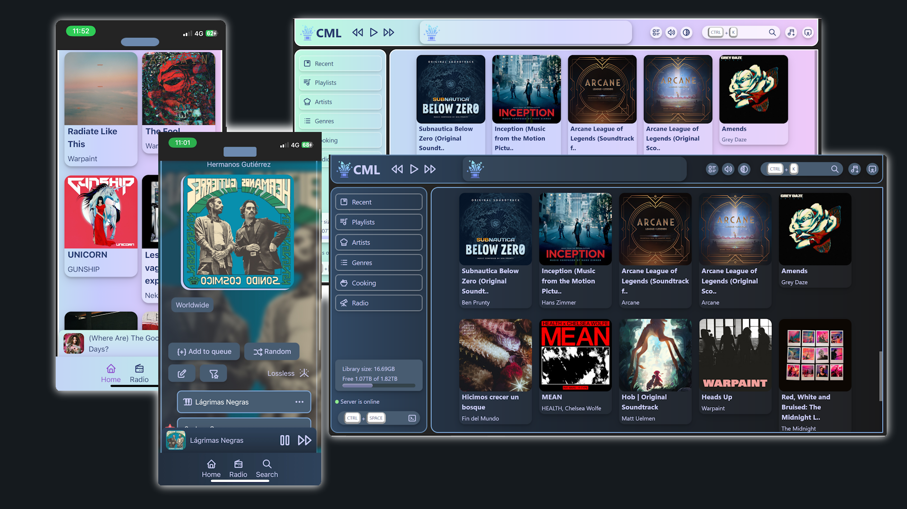
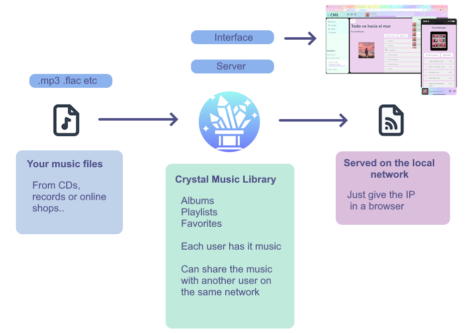
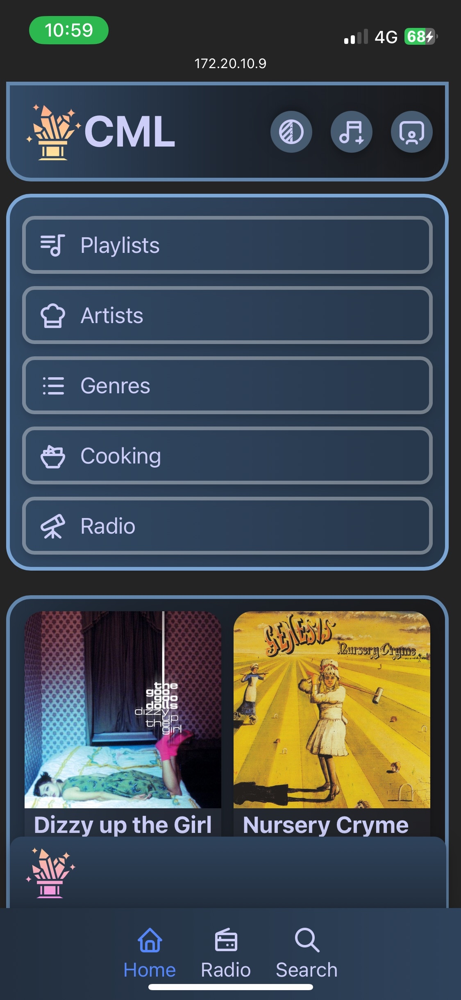
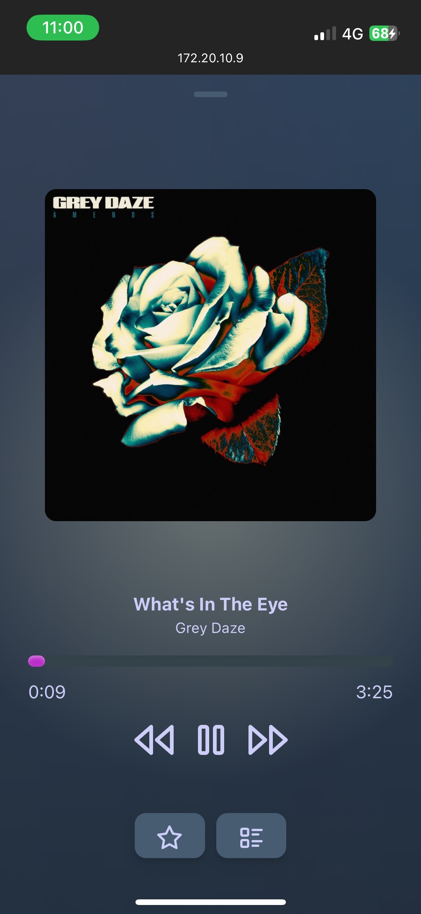
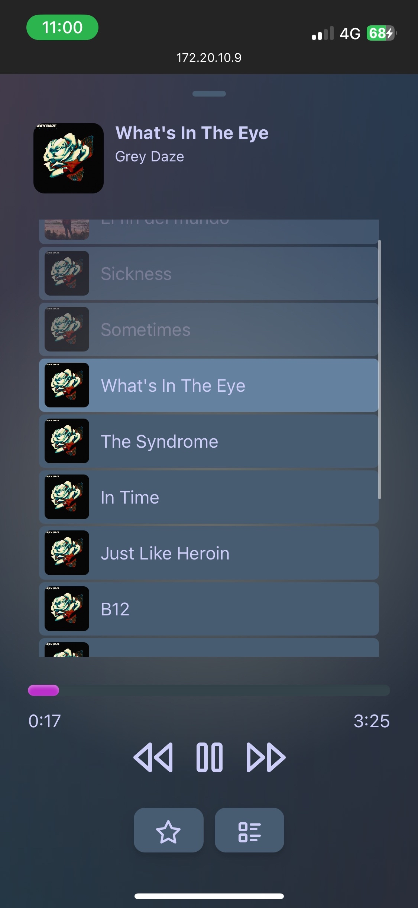
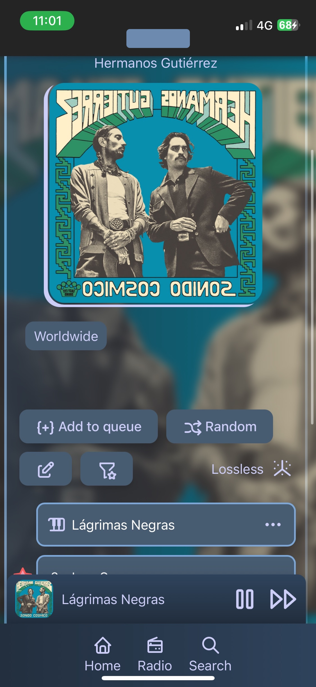
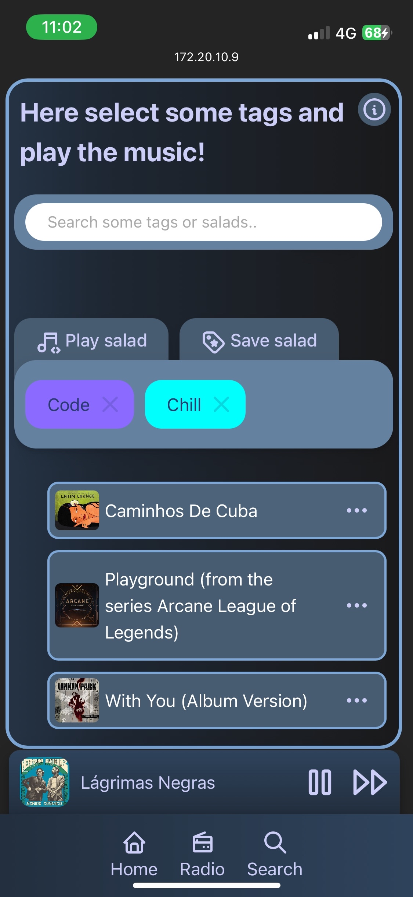
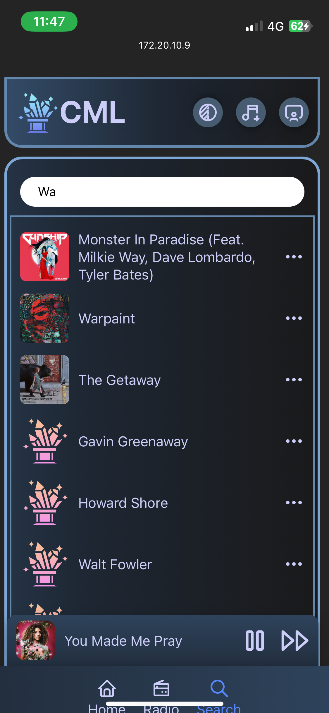
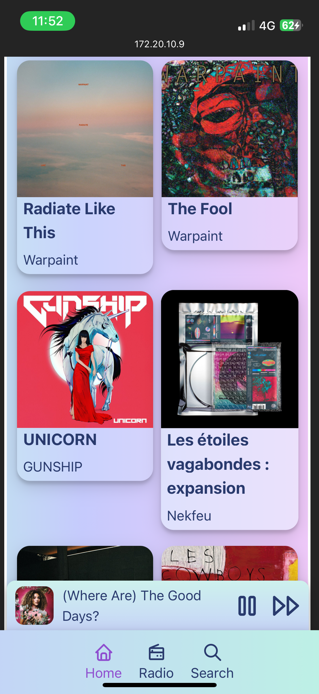
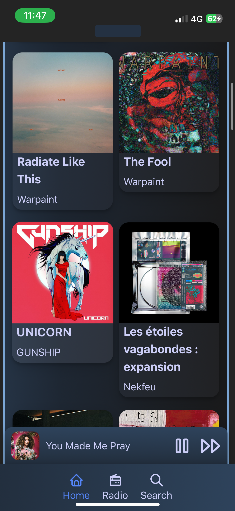

<p align="center">
    
<p>
<h1 align="center">Crystal Music Library</h3>
<h3 align="center">Self-hosted music library.</h3>




## What the Crystal Music Library is
<p align="center">

</p>

## Gallery
I do not own any cover artwork there. All right go to their owners, showcase purpose.
 


<p float="left">
  
   
  
</p>
<p float="left">
  
 
     
</p>
<p float="left">
  
 
</p>


## Setup
Download the executables from the latest release [here](https://github.com/Tamwyn001/CrystalMusicLibrary/releases/latest).
* Note: using pm2 on Linux, you can deamonize the server.js file. To do this download pm2 using npm, (download npm with nvm). The needed folder is /backend from the root of the repo.
*  
| Windows | Linux | Mac-Os |
|---------|-------|--------|
| x64     | x64   | see [Host with NodeJs](/doc/buildFromSource.md)    |

1. Unzip the files to a folder.
2. Open the ```.env``` file and set the variables:
   
   It may be not visible at first. In Windows go under display > show hidden files.
   
   **Avoid spaces next to the = signs**
    ```env
    CML_DATA_PATH='./data'
    # Where the music files and the album covers are stored.
    # This can be a heavy directory the more music you add.
    # Default, just next the executable.
    ```
    ```env
    CML_DATABASE_PATH='./db'
    # Where the database files are stored. 
    # Less heavy, they just make some relations between the musics.
    # Default, just next the executable.
    ```
    
    ```env
   CML_PORT=4590
    # The port where the server will be hosted. Default is 4590. 
    ```

3. Run the ```crystal-music.library.exe``` file on Windows or similar for other OS.
4. **If this step fails:** see [Host with NodeJs](/doc/buildFromSource.md)
5. Once the server is running, an IP will be printed, open it in the browser, or on your mobile phone.


## Use
1. Each time you want to use, you need to run the executable and open the address.
2. First you will need to register, but later you can just log in.
3. Add some music with the button ```+```, in the top right corner.
4. After uploading, refresh the page. 


## User system
If you want to share this with your local network, just register new users, when these open the link.

## Roadmap
- ✔️**v1.0.0**: 🎺 Minimal proof of concept : play songs and add music.
- ✔️**v2.0.0**: 💿 Playlists (tagging), genres, edit albums, search-bar, relocate songs, cross-fading
- ✔️**v3.0.0**: 🛠️ Internet radio, tutorial, spectrogram
- **v4.0.0**: 🎤 Speech recognition model based lyrics generation and linking external filebase
- **v5.0.0**: 📈 Library graph, complex song use analysis
